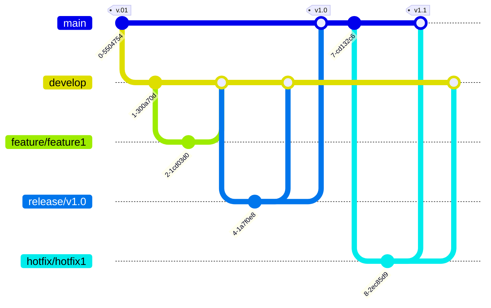

# Git Flow
Git Flow is a branching model that defines a strict branching structure designed for projects that have a scheduled release cycle. It involves multiple branches for different purposes: ``feature``, ``develop``, ``release``, ``hotfix``, and ``main``.

## Pros:

 - **Structured:** It provides a clear structure for managing releases, which can help in organizing large projects.
- **Separation of concerns:** Different branches for different stages of development ensure that various aspects of development like features, releases, and hotfixes are cleanly separated.

## Cons:

- **Complexity:** Can be overkill for small projects due to its complexity and the number of branches involved.
- **Learning Curve:** New team members may require time to fully understand and effectively use this model.

