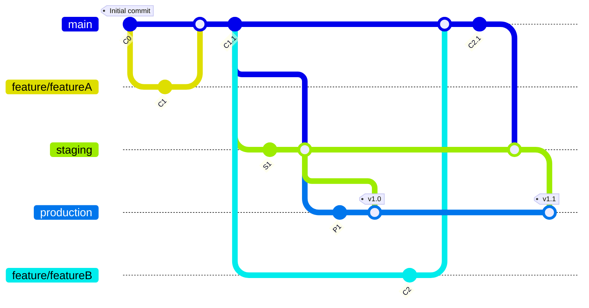

# GitLab Flow
GitLab Flow combines feature-driven development and feature branching with issue tracking. It extends GitHub Flow by incorporating environment branches like production, pre-production, etc., and using merge requests for code review.

## Pros:

- **Flexibility:** Suitable for both continuous delivery and environments with strict deployment stages.
- **Integration with CI/CD:** Works well with GitLab's built-in CI/CD features for automated testing and deployment.

## Cons:

 - **Dependency on GitLab:** Best suited for projects hosted on GitLab, as it leverages specific features of the platform.
- **Can become complex:** The addition of environment branches can increase complexity compared to GitHub Flow

## Graph

