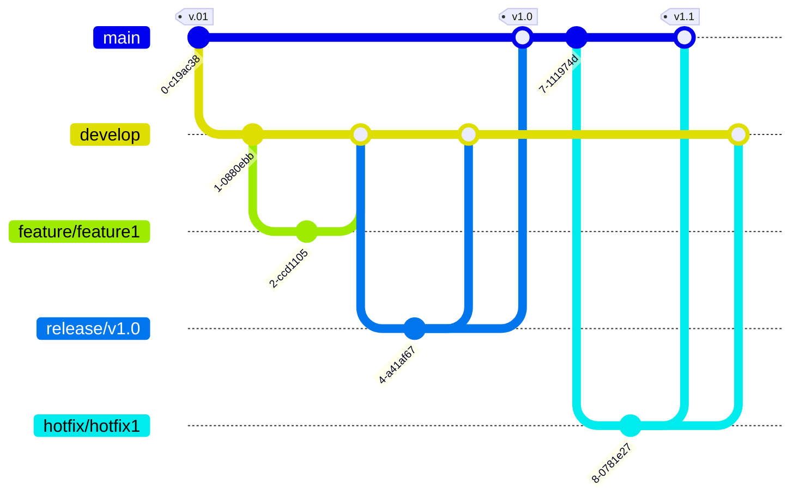

# Introduction to Git Flow

Git Flow is a branching model designed by Vincent Driessen in 2010. It's aimed at providing a consistent workflow for project development, enabling teams to collaborate more effectively on complex projects. The model specifies types of branches for different parts of the development lifecycle, including features, releases, hotfixes, and maintenance. This structured approach helps manage the project's development cycle, ensuring the main branch remains stable.

## Core Components of Git Flow

The Git Flow strategy includes several branch types, each serving a distinct purpose:

- **Master Branch**: The main branch where the source code of HEAD always reflects a production-ready state.

- **Develop Branch**: Originating from the master, this branch is where all development work happens, representing the next release in development. It's merged back into the master branch once it's stable and ready for release.

- **Feature Branches**: Branched off from the develop branch, each feature branch is created to work on a specific feature or improvement. It's merged back into the develop branch upon completion.

- **Release Branches**: Created from the develop branch when it has acquired enough features for a release or a predetermined release date is approaching. This branch allows for minor bug fixes and preparation tasks needed for a release. It's merged into master and develop upon completion.

- **Hotfix Branches**: Used to quickly patch production releases, these branches are based on master and are merged into both master and develop (or the current release branch) once the hotfix is complete.

## Advantages of Git Flow

- **Enhanced Collaboration**: Defining clear roles for each branch allows multiple developers to work on a project simultaneously without interference.

- **Improved Quality Control**: Separating new development from bug fixes enables more focused testing and validation.

- **Release Management**: Release branches make it easier to manage releases, allowing for last-minute tasks without holding up team progress on the develop branch.

- **Support for Emergency Fixes**: Hotfix branches provide a quick way to address production issues without disrupting ongoing work.

## Implementing Git Flow

Adopting Git Flow requires discipline and adherence to its branching model. Tools like SourceTree or the git-flow AVH version can automate some aspects of the Git Flow process, facilitating management.

## Conclusion

Git Flow is an effective branching strategy that improves the management of development projects, especially those with multiple collaborators. By organizing branches into feature, develop, release, and hotfix branches, teams can achieve high efficiency and maintain a stable codebase. Whether working on a small team project or a large-scale enterprise application, Git Flow can streamline your development process and help ensure successful project outcomes.

## FLow

