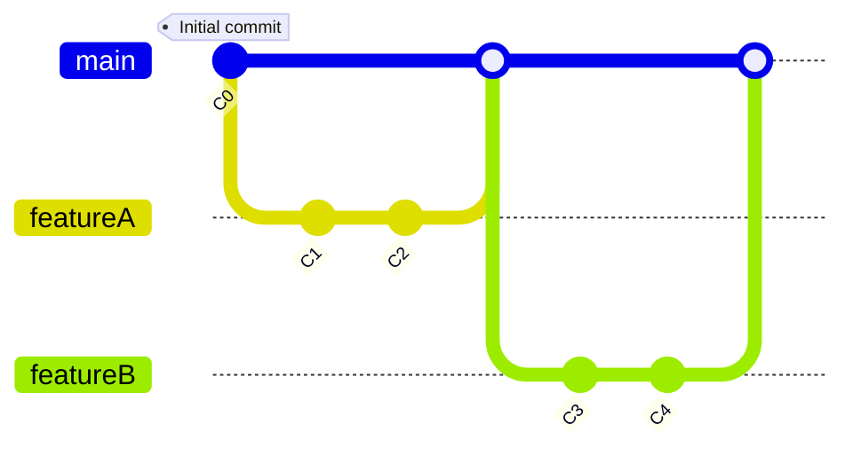

# Introduction to GitHub Flow

GitHub Flow is a streamlined, branch-based workflow designed for teams deploying regularly. It's a simplified approach emphasizing simplicity, effectiveness, collaboration, and speed, making it ideal for continuous delivery environments.

## The Core Principles of GitHub Flow

GitHub Flow is built on fast, continuous delivery, focusing on:

- **Main Branch as the Base**: The `main` (or `master`) branch is always deployable, reflecting the production state. All changes branch off `main`.

- **Feature Branches for New Work**: Develop new features, bug fixes, or experiments in dedicated branches off `main`, keeping the `main` branch stable.

- **Pull Requests for Collaboration and Review**: Use pull requests for code reviews, discussions, and approvals, ensuring high-quality code and shared understanding.

- **Commit Often, Push Often**: Frequent commits and pushes keep the team in the loop and integrate changes regularly, reducing conflicts.

- **Deploy from Main**: Deploy immediately once changes are merged to `main`, ensuring the production environment is always up-to-date.

- **Quick Fixes for Issues**: Address production issues with new branches, repeating the process for rapid deployment of fixes.

## Advantages of GitHub Flow

- **Simplicity**: With a straightforward workflow and fewer branches, GitHub Flow is easy to grasp and implement.

- **Continuous Delivery**: Supports a continuous delivery model for quick feature releases, fixes, and updates.

- **Flexibility**: Allows for quick adjustments, ideal for dynamic project environments.

- **Enhanced Collaboration**: Pull requests promote code review, discussion, and team involvement in every change.

## Implementing GitHub Flow

Adopting GitHub Flow involves a collaborative culture and automation, using CI/CD tools to automate testing and deployment, streamlining the development process.

## Conclusion

GitHub Flow is a streamlined branching strategy for teams valuing simplicity, collaboration, and continuous delivery. It supports rapid development cycles, enhances team communication, and ensures the production environment reflects the latest approved work. This approach suits environments with frequent deployments and a commitment to collaboration.

## Graph 

