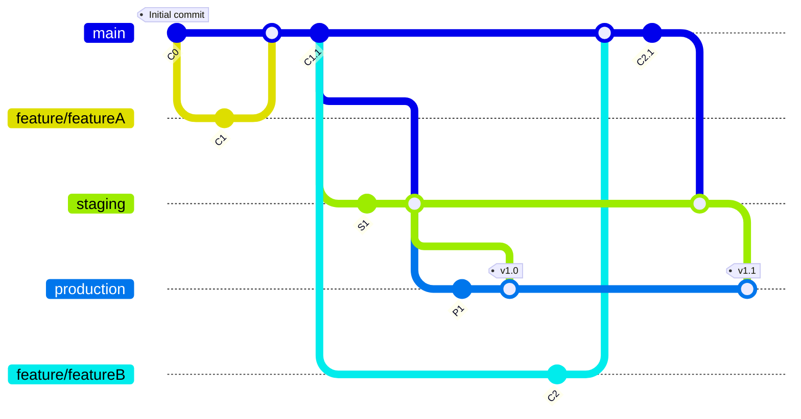

# Introduction to GitLab Flow

GitLab Flow is an advanced workflow model that enhances collaboration and efficiency in software development projects, accommodating the complexities of Continuous Integration (CI)/Continuous Deployment (CD) and sophisticated deployment environments.

## Core Components of GitLab Flow

GitLab Flow integrates key concepts for a comprehensive approach:

- **Feature Branches**: Develop new features, bug fixes, and improvements in separate branches off the main branch (`master` or `main`).

- **Environment Branches**: Manage deployments across different environments (e.g., staging, production) with branches corresponding to these environments.

- **Merge Requests**: Facilitate code review, discussion, and approval before changes are merged, using merge requests (MRs).

- **Issue Tracking**: Enhance traceability and project management by linking code changes directly to the issues they address.

## GitLab Flow Strategies

Adaptable to various requirements, GitLab Flow includes strategies like:

1. **Basic GitLab Flow**: Focuses on continuous delivery, similar to GitHub Flow but with merge requests for code review and integration.

2. **Environment Branches with GitLab Flow**: Introduces branches for each deployment environment, managing code promotion through stages in a controlled manner.

3. **Release Branches with GitLab Flow**: Uses dedicated release branches for scheduled releases, preparing releases without disrupting the flow of features into production.

## Advantages of GitLab Flow

- **Flexibility**: Supports a wide range of project types and deployment strategies.

- **Simplicity with Structure**: Offers an understandable model with the needed structure for complex deployments.

- **Enhanced Project Management**: Improves project management and team collaboration through integrated issue tracking and MRs.

- **Clear Environment Management**: Provides a clear path for code promotion across different deployment stages.

## Implementing GitLab Flow

Choose the strategy that best fits your project's needs, involving protected branches for environments, CI/CD pipeline configuration, and adopting a culture of MRs and code reviews.

## Conclusion

GitLab Flow is a versatile workflow that facilitates effective collaboration and project management, accommodating a wide range of development and deployment practices. It's ideal for teams seeking a balance between flexibility and control over their software delivery pipeline.

## Flow illustration

