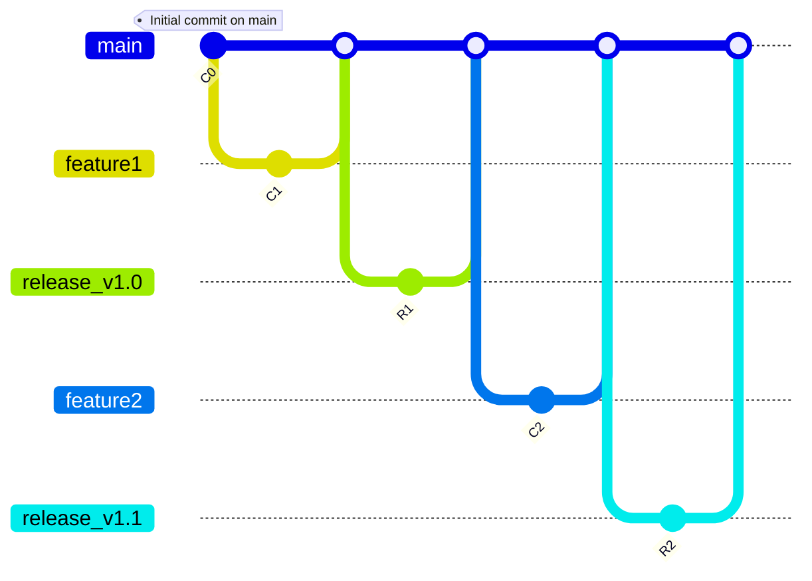

# Introduction to Release Flow

Release Flow is a Git branching strategy optimized for managing large-scale projects and enterprises, focusing on stability and efficiency in the release process. It's known for its use by Microsoft in managing projects like Visual Studio Code and Azure DevOps, simplifying the release aspect by combining elements from Git Flow and GitHub Flow with a focus on release management.

## Core Components of Release Flow

Release Flow revolves around key branches in the release process:

- **`master` Branch**: Holds production-ready code, with updates only from release branches to ensure stability.

- **Feature Branches**: For new features or bug fixes, created from `master` and merged back once completed and reviewed.

- **Release Branches**: Created from `master` for each release cycle, focusing on stabilization, testing, and final adjustments.

## Workflow of Release Flow

1. **Development**: Isolated development on feature branches off from `master`, ensuring the main codebase remains stable.

2. **Code Review and Merge**: Feature branches are reviewed and, upon approval, merged into a release branch or directly into `master` if ready for deployment.

3. **Release Preparation**: A release branch is used for final release preparations, including testing and bug fixes, focusing on stabilizing the release.

4. **Release to Production**: Once stable, the release branch is merged into `master` and deployed to production.

5. **Maintenance and Hotfixes**: Hotfix branches are created from `master` to address post-release issues, merged back, and deployed once fixed.

## Advantages of Release Flow

- **Simplicity**: Streamlines the release management process with fewer branches, enhancing understanding and implementation.

- **Stability**: Emphasizes testing and stabilization of release branches before merging to `master`, ensuring production code stability.

- **Control**: Offers greater control over release features and timing, allowing for strategic release planning.

- **Efficiency**: Optimizes the software development lifecycle for steady development, testing, and release pace.

## Conclusion

Release Flow provides a structured, efficient approach for managing releases in large-scale and complex projects, ensuring stability and control. Ideal for enterprises requiring reliability in their release cycles, it balances simplicity with rigorous quality assurance, making it a pragmatic strategy for various project sizes and complexities.

## Graph

